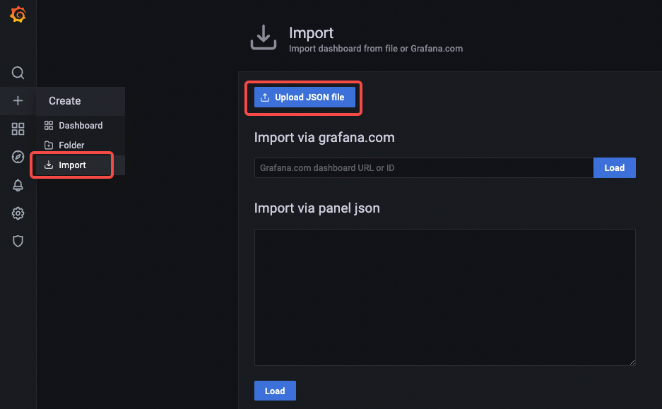

# README


### 部署要求

   * 拥有一个k8s集群，并可以连接到该集群, 如没有k8s集群可参考 [这个步骤](https://kuboard-spray.cn/guide/install-k8s.html#%E5%AE%89%E8%A3%85-kuboard-spray) 快速部署一个

   * 在操作的节点已经安装了python3和pip3，可执行python3 --version和pip3 list进行检查

   * 执行python3 primihub_require_check.py检查脚本

   * 修改images.yaml中的镜像（已指定默认镜像，可根据基线进行调整）


### 安装

* 指定你要部署的namespace名称，执行安装脚本完成部署
```bash
    cd k8s-deploy
    export NAMESPACE={namespace}
    ./primihub_deploy.sh （或执行python3 deploy.py）
```
    注意：目前脚本中指定了platform的nodeport端口，所以一个集群只能安装一套（多租户场景将再进行优化处理）
    


### 验证

查看对应pod的状态，是否均为Running
```
# kubectl get pod -n "你的namespace"
NAME                            READY   STATUS    RESTARTS   AGE
application1-6f75f8b6d8-fg7rt   1/1     Running   0          19h
application2-fcd4c4485-tmjwd    1/1     Running   0          19h
application3-9587566cd-h794f    1/1     Running   0          19h
fusion-675c489497-rbbvj         1/1     Running   0          19h
gateway1-c7ff4df4d-dgpc7        1/1     Running   0          19h
gateway2-5999778cb4-5bw9w       1/1     Running   0          19h
gateway3-7cfbb57b8d-hsmvz       1/1     Running   0          19h
mysql-0                         1/1     Running   0          19h
nacos-7cbcdb67bd-brj9c          1/1     Running   0          19h
platform1-6646bdb96b-xgvxg      1/1     Running   0          19h
platform2-54b8b78d65-24ns5      1/1     Running   0          19h
platform3-8bfd5b6f6-9lx5f       1/1     Running   0          19h
primihubnode-596f54469b-7z5r8   4/4     Running   0          19h
rabbitmq1-55f5b55bb9-5wwpl      1/1     Running   0          19h
rabbitmq2-5c9fbbb575-j7lpp      1/1     Running   0          19h
rabbitmq3-5cd59678cc-ftmpv      1/1     Running   0          19h
redis-595ff4c87b-p4qjj          1/1     Running   0          19h
```

### 说明
所有服务状态均为Runing后在浏览器分别访问

```
    http://k8s集群的任意一台机器的IP:30801

    http://k8s集群的任意一台机器的IP:30802

    http://k8s集群的任意一台机器的IP:30803
```
注意：此处的端口是在 [这个文件](./charts/platformchart/templates/platform-svc.yaml) 的第三行指定，如遇端口冲突可自行修改为别的可用端口

* 3 个管理后台模拟 3 个机构，默认用户密码都是 admin / 123456

* 管理平台具体的操作步骤请参考 [快速试用管理平台](https://docs.primihub.com/docs/quick-start-platform)


### 删除
执行以下脚本，将删除以上安装的所有服务

```
export NAMESPACE="你部署的namespace"
bash primihub_delete.sh
```

### k8s常用命令

```
kubectl get pod -n <namespace> 获取对应的pod信息
kubectl get svc -n <namespace> 获取对应的svc信息
kubectl get cm -n <namespace> 获取对应的configmap
kubectl get pvc -n <namespace> 获取对应的pvc
kubectl logs -n <namespace> <pod-name> -f --tail=100 查看对应pod-name的日志
kubectl exec -it -n <namespace> <pod-name> bash 进入到对应容器中
helm install <helm-name> -n <namespace>  charts/<chartname>chart  使用helm安装对应chart中的服务
helm uninstall <helm-name> -n <namespace>  卸载使用helm安装的服务
```

### loki安装
需要loki来查看日志时，grafana默认端口为30010,安装方式(因为loki组件中的promtail需要获取宿主机日志，所以需要您有集群的管理权限，需要能创建sa、role等资源)：
```
export NAMESPACE={namespace}
./primihub_deploy.sh loki 
```
    
grafana访问地址：
```
http://<your ip>:30010
默认账号admin，密码admin

模板ID可使用：13639，或导入logs-app_rev1.json模板文件
```


注意：loki默认只获取和展示本namespace的日志

删除loki:
```
export NAMESPACE={namespace}
./primihub_deploy.sh loki delete
```